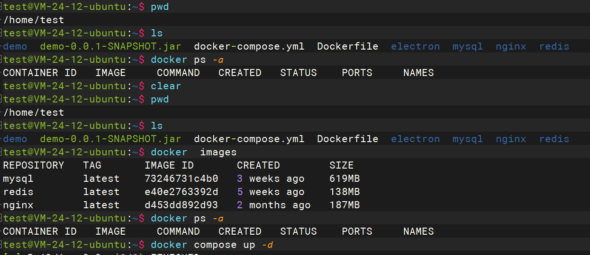
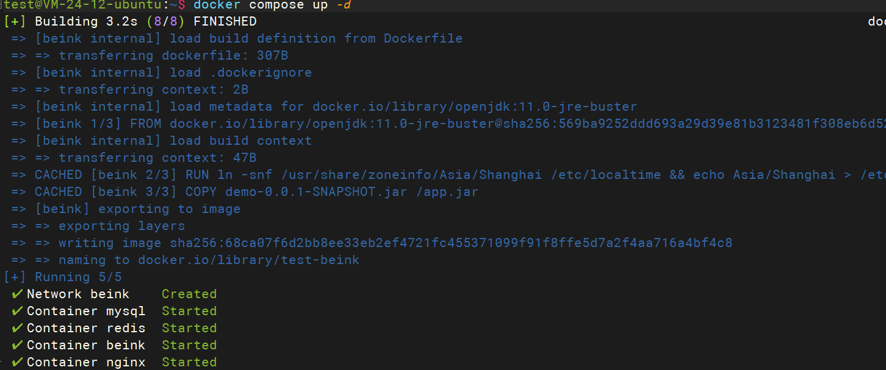
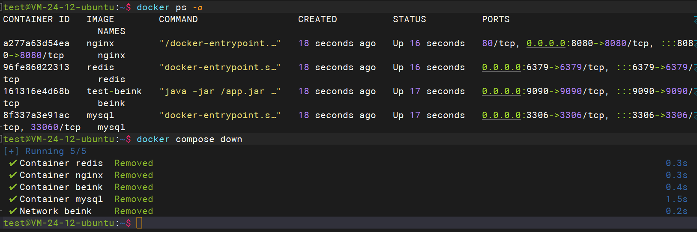

- docker pull redis
- docker pull mysql
- docker pull nginx







```
 mv demo-0.0.1-SNAPSHOT.jar beink.jar
```

```
docker build -t beink .
```

```
docker run -d --name beink --network beink  -p 9090:9090 beink
```

